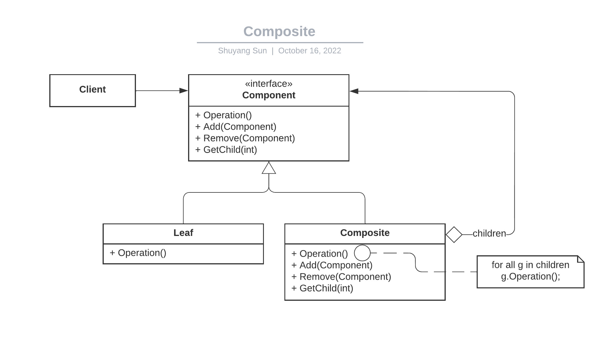

[Home](../../../../README.md) >> [Software Engineering](../../../../README.md#software-engineering) >> [Design Patterns](../../README.md) >> [Composite](./README.md)

# Composite

## Intent

Compose object into tree structures to represent part-whole hierarchies.

## Motivation

- Client can treat simple and complex object in a uniform way.
- Can recursively compose objects as complex as we want.

## Design

## Implementation

One important decision to make is whether to make the `Component` interface the intersection or union of all available operations.

- Intersection: need to add interface to attempt to cast each component to a `Composite`, then the API user would have to check whether the cast failed or not.
- Union: adding/removing/iteration children would not make sense on a leaf node, these operations can all fail.

## Related Patterns

[Iterator](../p16_iterator)
